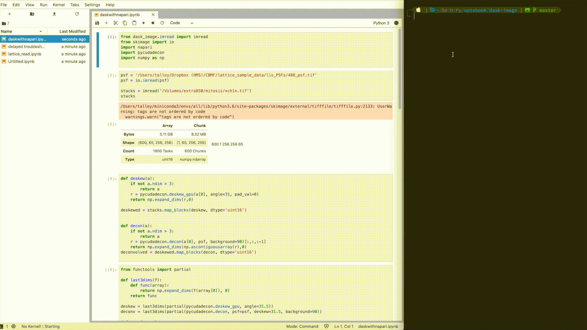

# jupyterblack

[](https://github.com/cristianmatache/jupyterblack/actions)
[](https://www.python.org/downloads/)
[](http://mypy-lang.org/)

[](https://github.com/psf/black)
[](https://dependabot.com)

[](https://pypi.python.org/pypi/jupyterblack)

[comment]: <> ([![pyv]&#40;https://img.shields.io/pypi/pyversions/jupyterblack.svg&#41;]&#40;https://pypi.python.org/pypi/jupyterblack&#41;)
[](https://raw.githubusercontent.com/irahorecka/jupyterblack/master/LICENSE)


Format code cells in Jupyter Notebook and JupyterLab using [Black](https://github.com/ambv/black).

<p align="center">
    
</p>

## It's as simple as calling jblack

```bash
jblack notebook.ipynb
```

## Install jupyterblack from the command line with pip

```bash
pip install jupyterblack
```

## Usage

```bash
# Format one Jupyter file:
jblack notebook.ipynb

# Format multiple Jupyter files:
jblack notebook_1.ipynb notebook_2.ipynb [...]

# Format a directory:
jblack python/

# Format one Jupyter file with a line length of 70:
jblack -l 70 notebook.ipynb

# Show help:
jblack -h
```

## Options

```bash
positional arguments:
  targets

optional arguments:
  -h, --help            show this help message and exit
  --check
  --pyi
  -l LINE_LENGTH, --line-length LINE_LENGTH
  -s, --skip-string-normalization
  -w WORKERS, --workers WORKERS
                        number of worker processes
  --show-invalid-code
  -t {py27,py33,py34,py35,py36,py37,py38} [{py27,py33,py34,py35,py36,py37,py38} ...], --target-version {py27,py33,py34,py35,py36,py37,py38} [{py27,py33,py34,py35,py36,py37,py38} ...]
```

## Contribute

- [Issue Tracker](https://github.com/irahorecka/jupyterblack/issues)
- [Source Code](https://github.com/irahorecka/jupyterblack/tree/master/jupyterblack)

## Support

If you are having issues or would like to propose a new feature, please use the [issues tracker](https://github.com/irahorecka/jupyterblack/issues).

## License

The project is licensed under the MIT license.
